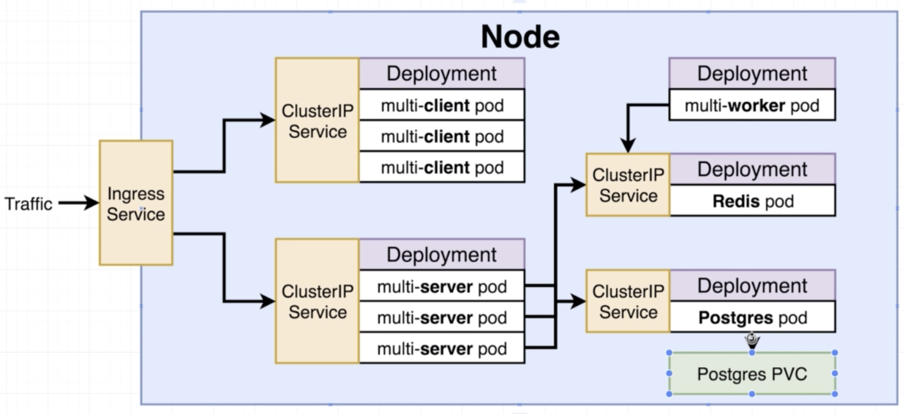
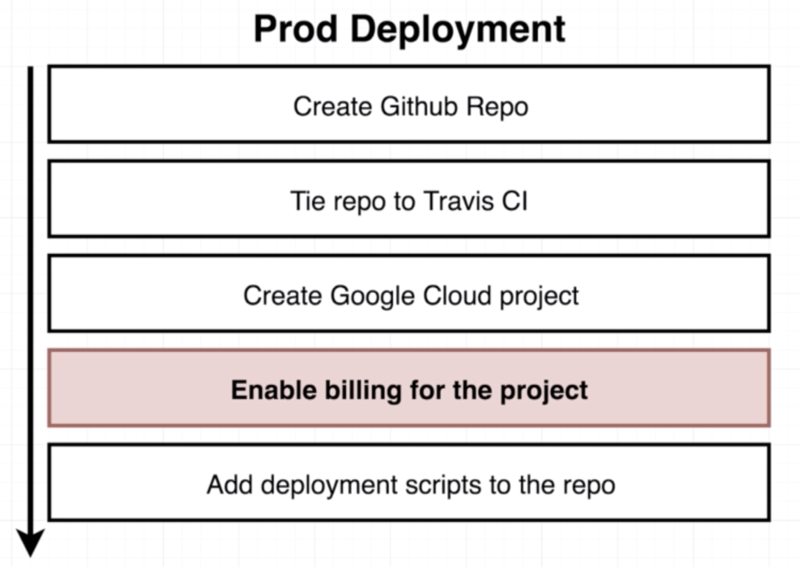

# Scalable microservices with Kubernetes

- Used microservices architecture to build a site containing client, server, worker, Nginx, PostgreSQL, Redis services. 
- Built a complete CI/CD workflow using GitHub, Travis CI, Docker Hub, Kubernetes, Google Kubernetes Engine.
  

## Miroservices

  

## Deployment steps

  
